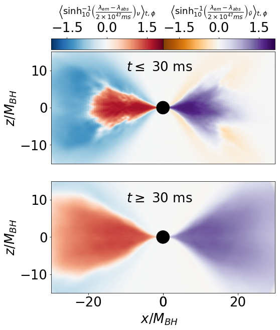

nubhlight: General Relativistic Neutrino Radiation Magnetohydrodynamics with Monte Carlo Transport
===




This software is approved for open-source release under LA-CC number C20019. Nubhlight was first presented in

- [Miller, J. M., Ryan, B. R., Dolence, J. C. 2019, ApJS, 241:2](https://doi.org/10.3847/1538-4365/ab09fc)

and is based on [ebhlight](https://github.com/AFD-Illinois/ebhlight), first presented in

- [Ryan, B. R., Dolence, J. C., & Gammie, C. F. 2015, ApJ, 807:31](https://doi.org/10.1088/0004-637X/807/1/31)

The above picture is from nubhlight's first application, modeling the 2017 neutron star merger event:

- [Miller, J. M. et al. 2019, PRD, 100:2](https://doi.org/10.1103/PhysRevD.100.023008)

All academic work derived from this software should reference these
publications. Questions, comments, and bug reports should be filed as
github issues. Pull requests are welcome.

# NUMERICAL SCHEME

nubhlight solves the equations of general relativistic radiation
magnetohydrodynamics in stationary spacetimes. Fluid integration is
performed with a second order shock-capturing scheme ([HARM; Gammie,
McKinney & Toth 2003](https://doi.org/10.1086/374594)).
Frequency-dependent radiation transport is performed with a second
order Monte Carlo scheme ([GRMONTY; Dolence et
al. 2009](https://doi.org/10.1088/0067-0049/184/2/387)). Fluid and
radiation exchange four- momentum in an explicit first-order
operator-split fashion.

# DEPENDENCIES

## Software

nubhlight is written in C99. It requires the following external libraries:
  - GSL
  - MPI
  - Parallel HDF5
  - gfortran (if Burrows opacities are used)

Configuration and analysis scripts are written in Python 3, and employ
matplotlib, numpy, and h5py.

If using gcc, version 4.9 or later is recommended.

## Data

For realistic problems, nubhlight relies on tabulated nuclear
equations of state and opacities and emissivities.
- A native reader exists for the opacities released on
[stellarcollapse.org](https://stellarcollapse.org/).
- A FORTRAN reader exists for opacities developed by the Adam Burrows' group.
- An HDF5 reader exists for opacities defined in `nubhlight`
  format. See `core/opac_emis_hdf.c` for the reader and for
  information for how to define your own such table.
- The HDF5 opacity reader does not exactly support NuLib opacities,
  however, [a fork of
  NuLib](https://github.com/Yurlungur/NuLib/pull/1) exists that
  contains the relevant modifications to run with nublhight.


# CLANG FORMAT

clang-format is used to format source files. It's part of the clang
toolchain and can be found and described [here](https://releases.llvm.org/3.8.0/tools/clang/docs/ClangFormat.html).

You can integrate clang-format into your editor. You can also add it
as a git pre-commit hook so that all your changes are automatically
formatted. To enable this, copy
`script/dependencies/pre-commit.clang-format` into your git hook. e.g.,

```bash
cp script/dependencies/pre-commit.clang-format .git/hooks/pre-commit
```

# CONFIGURATION

A custom build script is used for each problem to:
  - Set compile-time code parameters
  - Set machine-specific dependency locations
  - Collect copies of all required source files
  - Write a problem-specific makefile
  - Call make to compile the source and create an executable
  - Clean up temporary files

To run, for example, the Sod shocktube problem:
```bash
cd bhlight/prob/sod
python build.py
./bhlight -p param_template.dat
```

# I/O

File input and output are performed with HDF5. In the active output directory,
dumps/ and restarts/ folders are created, holding dump and restart output,
respectively. Output directories may be specified at runtime by passing the flag

```bash
-o /path/to/output/directory/
```

to the executable.

# AUTOMATIC TESTING

Scripts are provided for automatically running and analyzing certain test
problems.

To run, for example, the Sod shocktube test:
```bash
cd bhlight/test/
python sod.py
```
which will produce `sod.png` in the current directory, showing the numerical and
analytic solutions.

Several automatic tests are run through continuous integration on
commit. Tests must pass before a pull request will be merged.

# RUNTIME PARAMETERS

Runtime parameters are read in from a (required) parameters file passed to the 
executable as `-p path/to/parameter/file`. A default param.dat file is generated
alongside the executable by the build routine. Note that this build routine 
overwrites param.dat each time it is called -- if you wish to preserve your 
runtime parameters, change the filename from param.dat. 

Problem-specific runtime parameters are also available. Each `problem.c` file 
contains a routine void `set_problem_params()`. To include a problem parameter
"test" (here a double, but 'int' and 'string' are also allowed) accessible from 
the parameter file, there are three steps:

- Define your variable in problem.c in file scope (internal linkage 
recommended)

- Call the parameter read function inside set_problem_params()

After these steps you should have
```C
static double test;
void set_problem_params()
{
  set_param("test", &test);
}
```

- Use the problem's build.py script to request your new variable as a runtime
parameter, with the line `bhl.config.set_rparm('test', 'double', default = 100)`

The 'default' parameter is optional.

# Copyright

copyright 2020. Triad National Security, LLC. All rights reserved.
This program was produced under U.S. Government contract
89233218CNA000001 for Los Alamos National Laboratory (LANL), which is
operated by Triad National Security, LLC for the U.S.  Department of
Energy/National Nuclear Security Administration. All rights in the
program are reserved by Triad National Security, LLC, and the
U.S. Department of Energy/National Nuclear Security
Administration. The Government is granted for itself and others acting
on its behalf a nonexclusive, paid-up, irrevocable worldwide license
in this material to reproduce, prepare derivative works, distribute
copies to the public, perform publicly and display publicly, and to
permit others to do so.
